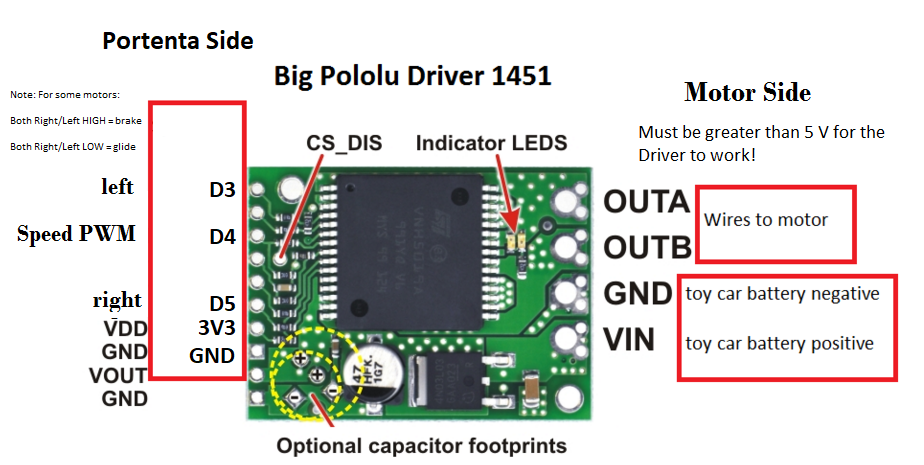

BLOG POST

# Shredder RoboCar with the Arduino PortentaH7 and Vision Shield.

## TINYML, MACHINE LEARNING, EMBEDDED DEVICES

Jeremy Ellis

May 30, 2023


I wanted a long-term project for students willing to do extra work and interested in both Arduino and Vision Machine Learning. Taking an RC car and turning it into a roboCar with vision self-driving was the answer. This high-level, long-term project is great for students who want a harder-than-normal challenge.


We picked a certain RC car "[RC Pro Shredder](https://bchobbies.com/products/shredder112scale4wdbrushedmonstertruck)" that did not use a brushless motor as the programming of brushless motors has extra complexity. We also needed a big motor driver, a servo motor, connectors, USB cable and USB battery pack, as well as the ability to 3D Print large objects. See [price-list.md](price-list.md)


## This is a difficult build and may need some adaptations for your project: For example, we used a large print-bed 3D printer to make the 10.5 inch long frame (26.7 cm). You may choose to split that frame up or put the hardware somewhere else on the car.


The software to use is online as part of my Arduino IDE ready library the "[Portenta Pro Community Solutions](https://github.com/hpssjellis/portenta-pro-community-solutions)". A huge library of ready-made examples to use with the Arduino PortentaH7 and other Arduino MBED boards.


The library is so big I had to make a reference system to find examples. The RoboCar code examples are in the "dot55" area.

https://github.com/hpssjellis/portenta-pro-community-solutions/tree/main/examples/dot5-portenta-machine-learning/dot55-robocar


## Main Build steps

1. Purchase parts: First, you need to purchase the parts required to build the car. Check out the price list provided and make sure to purchase all the required parts without exceeding your budget. Checkout the price list at [price-list.md](price-list.md)
     ## List of suggested first-time purchases:


      1. [RC-Pro SHREDDER](https://www.rcpro.ca/collections/shredder/products/shredder) $189.99 CDN  
      2. [WSD1302 plug set](https://www.rcsuperstore.com/ws-deans-2-pin-ultra-plug-set-one-male-one-female-included/) 2 sets  $2.99 USD
      2. [Bullet Connectors](https://www.amazon.com/AIRIC-Bullet-Connectors-Insulated-Terminals/dp/B08ZSQZCCR?th=1) only need 2 female bullet connectors this is a set of 50 for  $11.99 USD
      4. [Big VNH5019 Motor Driver Carrier](https://www.pololu.com/product/1451) $44.95 USD 
      5. [3 wire Servo ](https://www.rcpro.ca/collections/shredder/products/shredder-3-wires-19gram-metal-gear-servo)  $24.99 CDN
      6. [Arduino PortentaH7](https://store-usa.arduino.cc/products/portenta-h7)  $103.40 USD 
      7. [Arduino LoRa Vision Shield](https://store-usa.arduino.cc/products/arduino-portenta-vision-shield-lora%C2%AE) $63.25 USD
      8. [https://www.waveshare.com/1.5inch-oled-module.htm](https://www.waveshare.com/1.5inch-oled-module.htm) $12.99 USD
      9. Will also need a USB-C cable, USB battery pack,  micro-sd card and polarized sunglasses. A 3D printer would be useful.

3. Have fun with the RC car: Without breaking it, charge the battery and drive it around to test the tight turning circle diameter and slowest speeds that it still moves.
4. Find objects to track: To train your model, you need to find objects to track. You can use double-sided black circles on photocopy paper and cut them out. [../media/eyes-pdf.pdf](../media/eyes-pdf.pdf)   
5. Build the car frame:     3D print the car frame using the provided STL files [../media/rc-Car-frame28-22degrees-V28-22-degrees.stl](../media/rc-Car-frame28-22degrees-V28-22-degrees.stl) or these smaller prints [../media/rc-Car-frame27-bread-front.stl](../media/rc-Car-frame27-bread-front.stl)   and [../media/rc-Car-frame27-bread-back.stl](../media/rc-Car-frame27-bread-back.stl) or make one with wood or cardboard. Make sure to attach the PortentaH7 with LoRa vision shield on the car along with a USB-C cable with a battery pack, and attach it to the car while it still has the RC components working. This allows you to drive the car while taking lots of images on the SD card. You will need this program [dot362-png-to-sd-card.ino](https://github.com/hpssjellis/portenta-pro-community-solutions/blob/main/examples/dot3-portenta-vision-shields/dot36-camera-png-to-web/dot362-png-to-sd-card/dot362-png-to-sd-card.ino). Note line 75 ```int myDelay = 10000;``` sets a variable to take an image every 10 seconds. change that number to about 500 to take lots of .PNG pictures.  You might want to attach sunglasses to the model if reflections are a problem when using the car inside.

5. Train the model: Upload the images to Edgeimpulse.com  and train a FOMO model on EdgeImpulse.com, or grab the main one I use: [here ei-ei-v25-fomo-eyes-shades-arduino-1.0.2.zip](https://github.com/hpssjellis/portenta-pro-community-solutions/blob/main/zipped-libraries/edge-Impulse/arduino-exported/Portenta-Camera/ei-ei-v25-fomo-eyes-shades-arduino-1.0.2.zip). The following steps to train the machine learning model are mirrored on this site with images at [https://hpssjellis.github.io/multi-language-edgeimpulse-tutorial-vision-cell-phone/](https://hpssjellis.github.io/multi-language-edgeimpulse-tutorial-vision-cell-phone/)
      1. login or register for [Edgeimpulse.com](Edgeimpulse.com) <br>  <br> 
      2. On the dashboard, go to the far right and change the label type from "one label" to "bounding boxes." This sets up the model for FOMO (faster objects, more objects) vision. Also, set Target Device to "Arduino PortentaH7 (Cortex M7 480 MHz)" <br> <br><br>
      3. Use the menu connect devices and go to uploader and upload your images that you took of the car driving around your object to detect
      4. Go to the menu item Data Acquisition and click on the "Queue" and start drawing bounding boxes around your objects. <br><br> "Make sure the label is the same for all of them I use "1eye". The number one in front is very important. <br>
      5. Once all images are labelled, create your standard FOMO model by clicking "create impulse" and choose the standard Edge Impulse image and object detection blocks. Check before saving the impulse that it has only one object.
      6. For the menu item "image" make sure you are saving Grayscale not RGB and save it. 
      6. In the "Image" menu item, click on "Generate Features" wait a few minutes to see the "Feature explorer". Check for weird images and delete or change them as needed.
      7. In the menu item "Object Detection" set number of training cycles to about 220 (or whatever works for your project). Add "Data Augmentation" and "start Training" takes about 8 minutes.  
      8. Check your F1 score and confusion matrix, which should be reasonably good hopefully above 80% for the background and the 1eye labelled object
      9. Test the model on your phone or download it to the Arduino. A reminder this is an Arduino library so you will need to  upload it into the Arduino IDE as a zipped library.
      10. Check the library file name so you can change the library that is in the default program to the new name.
      11. Always place the car on a small box when testing it as it could jump off the table and break.
      12. Flash the code to the Portenta connected to your car. Make sure both batteries are charged. 
      13. Always unplug both batteries when you have finished testing the car.
      14. Return to Edgeimpulse and try to improve your model.
7. Download the exported Edgeimpulse arduino library and install the .zip file into the Arduino IDE (Sketch--> Include Library --> Add .ZIP Library). This is a long compile depending on your computer speed. Expect about 20 min for this to complete the first time, about 3 min each time after that. Just testing that this code compiles and can load onto the Portenta with vision shield and a serial monitor output shows that it is working is a huge step. Well done if it works.
8. Load the Arduino sketch [dot551-robocar-v1.ino](https://github.com/hpssjellis/portenta-pro-community-solutions/blob/main/examples/dot5-portenta-machine-learning/dot55-robocar/dot551-robocar-v1/dot551-robocar-v1.ino) but loading it is easy from the Arduino IDE installed "Portenta Pro Community Solutions" library sketch dot551 (check for newer versions) as it will also load the included file ```#include "edge-impulse-advanced-v2.h"```. If you want you can manually load that included file from: [edge-impulse-advanced-v2.h](https://github.com/hpssjellis/portenta-pro-community-solutions/blob/main/examples/dot5-portenta-machine-learning/dot55-robocar/dot551-robocar-v1/edge-impulse-advanced-v2.h). It is just a way to get rid of the complex coding, so your main file only has the necessary code that you might want to change.
9. If you have the WaveShare grayscale 128 x 128 OLED then attach the correct pins ```  GRAYSCALE Waveshare OLED wire connections to the Portenta: , black GND, red 3v3, blue  DIN (mosi) D8, yellow (sck) D9 , orange (cs) D7, green (dc)  D6, white (reset) not needed ``` and run the code and observe your model if it works. This code [dot229-128x128-gray-oled.ino](https://github.com/hpssjellis/portenta-pro-community-solutions/blob/main/examples/dot2-portenta-h7-with-accessories/dot22-actuators/dot229-128x128-gray-oled/dot229-128x128-gray-oled.ino) can be used just to test the WaveShare OLED with the Portenta
10. Remove the 5 wire servo that comes with the shredder car and attach the 3 wire servo. The ball joints are a bit difficult to replace. Test the servo Portenta connection with this code [dot221-servo.ino](https://github.com/hpssjellis/portenta-pro-community-solutions/blob/main/examples/dot2-portenta-h7-with-accessories/dot22-actuators/dot221-servo/dot221-servo.ino)  Here is an image of the entire wiring diagram  <br>
11. Using a long breadboard attached to the car, connect the Big Motor Drive (Motor Driver test code [dot227-big-dc-motor-driver.ino](https://github.com/hpssjellis/portenta-pro-community-solutions/blob/main/examples/dot2-portenta-h7-with-accessories/dot22-actuators/dot227-big-dc-motor-driver/dot227-big-dc-motor-driver.ino) )  <br><br> Make sure the high car voltage is kept away from the 5 volt USB input for the Portenta.
12. A tricky part of the car build is getting the main battery power to the big motor driver and deciding on if the main battery is going to power the portenta. We tried step-down 5V regulators etc, but the Portenta seemed very sensitive to power fluctuations when the car was running so I just powered the Portenta with a 5V USB battery pack attached to the top of the breadboard. Your big motor driver will need connectors for both the main battery and the motor. See price list [price-list.md](price-list.md)
13. Test that the mechanical parts of the car are working by running this test code which puts together both the servo and big motor driver: [here ../media/a01-motor-testing.ino](../media/a01-motor-testing.ino). This allows you to check the motor slowest speed and best full turning angle. (Don't push the angles too far as the servo motor complains)
14. Once everything is proven to work, upload the main code again, change a few of the variables such as PWM_MIN and maximum turning angles, and try out your car
15. Start editing the code to make it work better
16. Also edit the 3D Printing to add lights, etc.
17. Share your code on social media and link to twitter @rocksetta 
 


My student's cars:


# Conclusion

I hope you enjoyed this difficult project, it involved Arduino maker connections to a DC motor and Servo motor with Machine Learning using edgeimpulse.com and problem-solving to improve the Vision FOMO model. When you have the working car students can start making extensions, such as lighting and battery monitoring, including adaptions for if the car loses the trail. Good luck and I hope you had fun.
<br>


